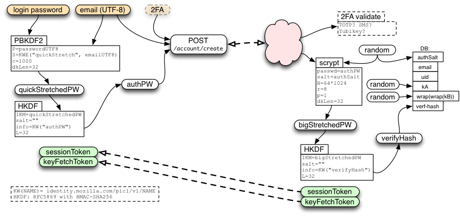
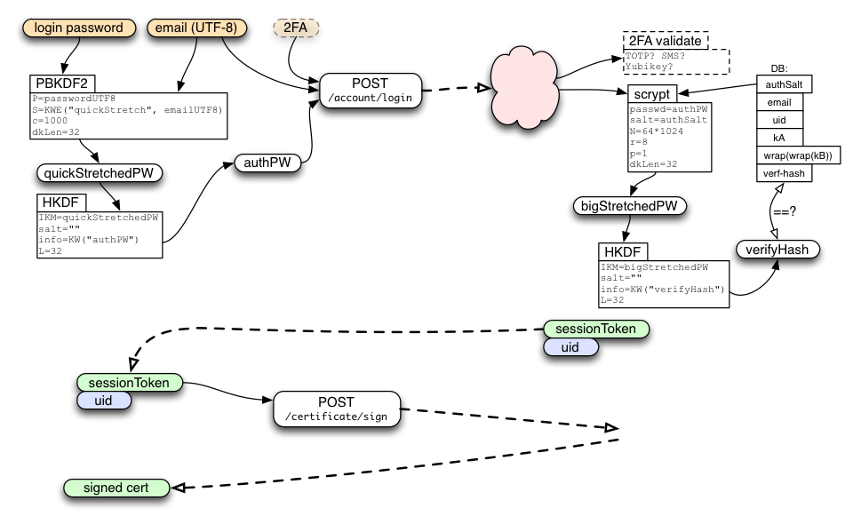
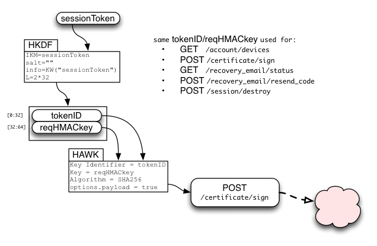
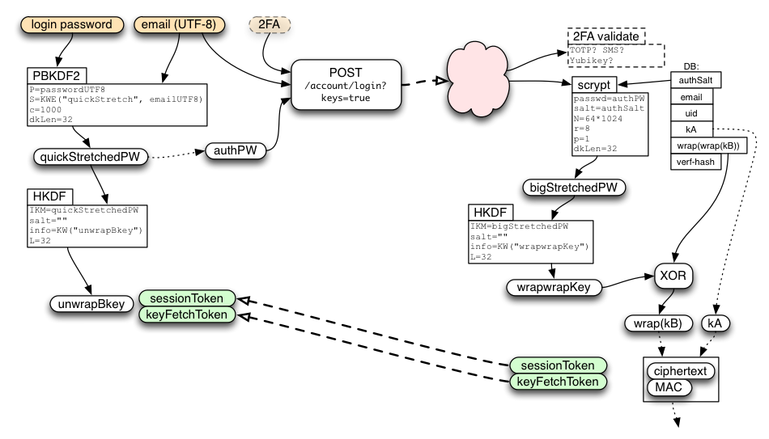
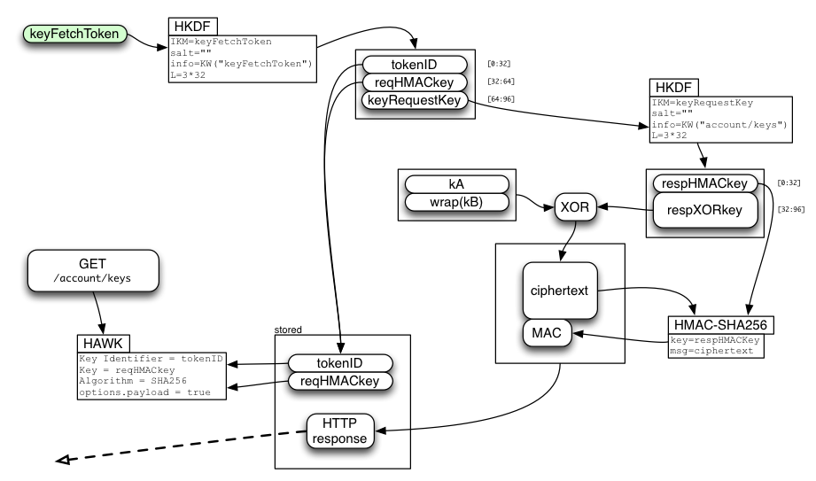
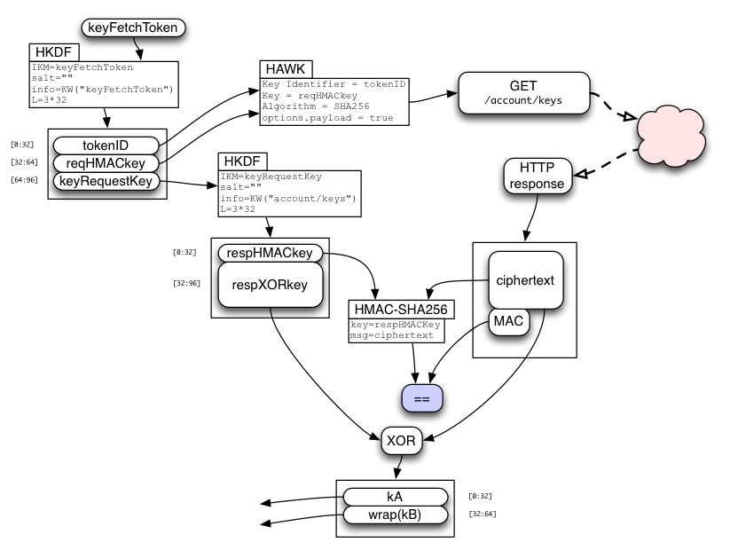
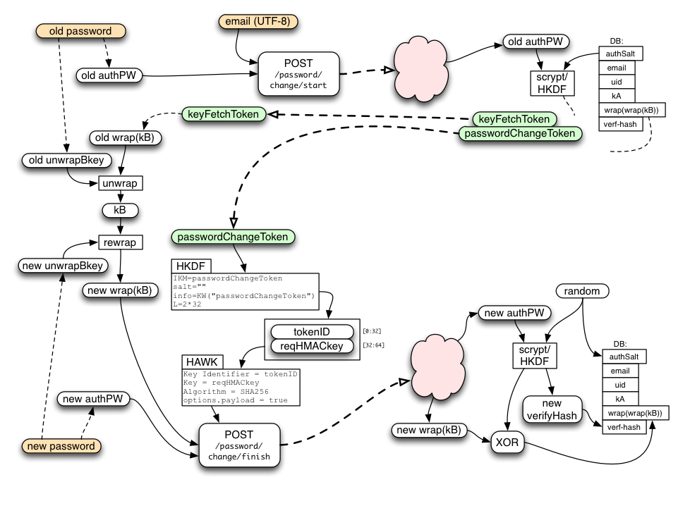
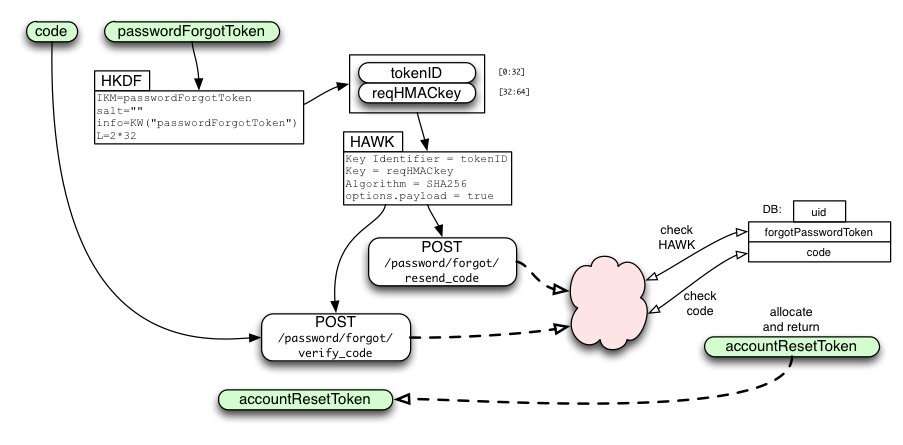
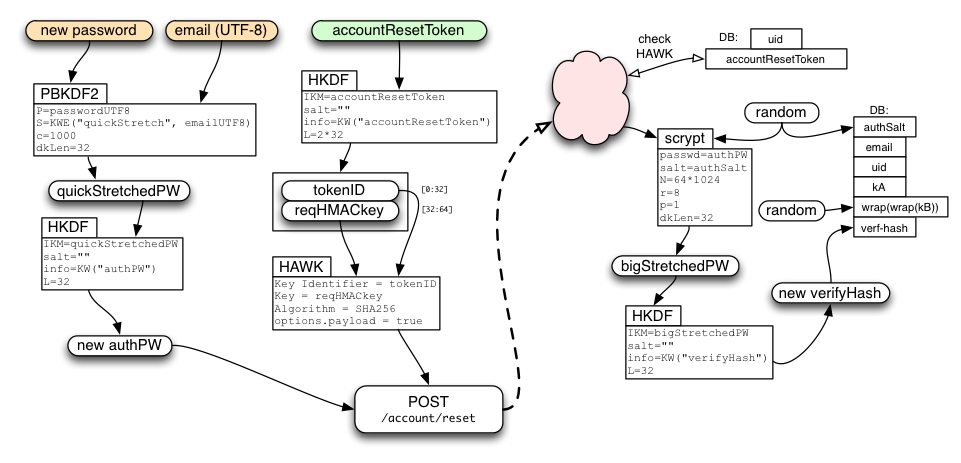

# Firefox Accounts/Sync Protocol

This document describes the protocol used by FxA clients (including FF Sync clients) and the key-server implemented in the [FxA auth-server](https://github.com/mozilla/fxa/tree/main/packages/fxa-auth-server). Clients use this protocol to prove their knowledge of the account password, for which they receive a `sessionToken`, which can be used to obtain a signed BrowserID certificate (which can be used to convince subsequent relying parties that they control the account). This protocol is also used to retrieve a pair of encryption keys (`kA` and `kB`) which will be used to encrypt Sync data.

The protocol is designed to protect the user's data as best as possible given the design constraints (including the use of a single user password, and CPU+memory limitations of slow mobile clients). Other protocols will be introduced later, in environments that can handle them, to improve data protection further.

Note that all messages are delivered over an HTTPS connection. The client browser may also implement cert-pinning to improve on the certificate validation process. The protections described below are in addition to those provided by TLS.

This is the protocol used to manage FxA accounts and Sync clients for Firefox 29, due to be shipped in late April 2014. It replaces the J-PAKE -based pairing setup protocol that's been in use since Firefox 4.0.

# Overview

Clients have an email address and a password (which is never sent directly to the fxa-auth-server). A fairly simple protocol is used to prove knowledge of the password, which gives the client a session token that they can use later.

A slightly more complex protocol is used to obtain the sync encryption keys.

The server remembers several secrets per client. The main one is the "verifier hash", which is used to test the client's knowledge of the account password. The other two secrets are `kA` and `wrap(wrap(kB))`: `kA` is the class-A sync key (for data which can be recovered through an email challenge link), and `wrap(wrap(kB))` is unwrapped by the client to get `kB` (for data which can only be recovered by knowledge of the password).

Note that the class-A key is not currently used for any sync data.

## Client-Side Key Stretching

"Key Stretching" is the practice of running a password through a computationally-expensive one-way function before using it for encryption or authentication. The goal is to make brute-force dictionary attacks more expensive, by raising the cost of testing each guess.

To protect the user's class-B data against a TLS-breaking eavesdropper or active compromise of our keyserver (so the attacker gets to see `authPW` as it is sent to the server), we perform some key stretching on the client. This makes it more difficult to brute-force the original password from `authPW`. To further improve protection against static compromise (where the attacker sees the stored `verifyHash` and `wrap(wrap(kB))` in the server's database), we do additional stretching on the server. For details about how this stretching is used to wrap keys, see [Fetching Sync Keys](#fetching-sync-keys), below.

On the server, we use the memory-hard "scrypt" function (pronounced "ess-crypt") for this purpose, as motivated by the attacker-cost studies in [Identity/CryptoIdeas/01-PBKDF-scrypt](https://wiki.mozilla.org/Identity/CryptoIdeas/01-PBKDF-scrypt).

The goal is to ensure all values in the server's long-term storage will require at least the hard scrypt-based stretch to test each password guess. All values sent over the wire or temporarily held in server memory should require at least the weaker PBKDF stretch for each guess.

# Creating The Account

The first act performed by a user is to create the account. They enter email+password into their browser, which then does the following steps:

* runs 1000 rounds of PBKDF2, using the email address as a salt, to produce "quickStretchedPW"
* feed quickStretchedPW into HKDF to obtain "authPW"
* deliver (email, authPW) to the keyserver's `POST /account/create` API



The server creates a random 32-byte `authSalt`, and uses it to stretch `authPW` further, using scrypt (64k/8/1), to derive `bigStretchedPW` and `verifyHash`. It then stores `authSalt` and `verifyHash` in the database.

In addition, the server creates both `kA` and `wrap(wrap(kB))` as randomly-generated 256-bit (32-byte) strings. It stores these, along with all the remaining values, indexed by email, in the account table where they can be retrieved later.

The `/account/create` call allocates and returns a `sessionToken` (described below), just as if the client had immediately performed a login. In addition, if the `/account/create` request path included a queryarg of `keys=true`, the call will allocate and return a `keyFetchToken` (also described below).

To prevent fixation attacks, we require new accounts to verify their configured recovery email address before letting them learn the generated keys or obtain a signed certificate. The server will send email with a URL that contains a long random "verification code" in a query argument. This URL points to a static page with some javascript that submits the code to the `POST /account/recovery_methods/verify_code` API. The URL can be clicked by any browser (it is not bound to anything), and when the API is hit, the account is marked as verified.

The account will issue sessionTokens and keyFetchTokens without email verification, but they cannot be used (for much) until verification is complete.

# Login: Obtaining the sessionToken

To connect a browser to an existing account, we use the following login protocol to transform an email+password pair into a sessionToken. The sessionToken will be used in the next section to obtain signed certificates.

This protocol starts by feeding the password and email address into 1000 rounds of PBKDF2 to obtain "quickStretchedPW", feeding quickStretchedPW into HKDF to get "authPW", then delivering email+authPW to the server's `/account/login` endpoint.



The server uses the email address to look up the database row, extracts authSalt, performs the same stretching as during account creation to obtain "bigStretchedPW" and then "verifyHash", then compares verifyHash against the stored value. If they match, the client has proven knowledge of the password, and the server creates a new session. The server returns the newly-generated sessionToken to the client, along with its account identifier (uid).

In the future, the `/account/login` endpoint may also accept two-factor authentication data. If so, it is likely to return a "2FA-required" error to the first request, with information on what additional UI should be displayed to solicit the additional data. The response should also indicate an "account mode", with a known string for this first (one-password) mode. When we add the two-password mode (described below), any account which has been moved to the new mode will return a different string, and then older clients (who don't understand the new mode) should display an error to the user prompting them to use a newer version of the client.

The `/account/login` call should also include information about the client device, such as a host name, profile name, model number, etc. This will be used to describe the session to the user later, when they enumerate their active sessions (for review and possible revocation).

If the client wants to get encryption keys for Sync in addition to signed certificates, it should use `POST /account/login?keys=true`, which returns a keyFetchToken in addition to the usual sessionToken.

## Creating a Session

Each successful call to `/account/login` or `/account/login?keys=true` results in a new session (with a unique+unguessable sessionToken). The server can support multiple sessions per account (typically one per client device, plus perhaps others for account-management portals). The sessionToken lasts forever (until revoked by a password change or explicit revocation command), and can be used an unlimited number of times.

Many keyserver APIs require a HAWK-protected request that uses the sessionToken. Some of them require that the account be in the "verified" state.

* GET /account/devices
* POST /session/destroy
* GET /recovery_email/status
* POST /recovery_email/resend_code
* POST /certificate/sign (requires "verified" account)

## Email Verification

As above, to prevent fixation attacks, new accounts must verify their email address before they can learn keys or obtain a certificate. Nevertheless, we wish clients to forget the user's password while they wait for email verification to complete. To achieve this, clients can obtain a sessionToken before verification, but most APIs that require it will raise errors until verification is finished.

A successful `/account/login` response includes information about the verification status of the account. If necessary, the client can use `/recovery_email/status` endpoint (which requires a sessionToken but not account verification) until the user clicks the email link and the API reports verification is complete. Then the client can use `GET /account/keys` and `POST /certificate/sign`, described below.

If the client merely wants certificates and doesn't care about encryption keys, it can use `POST /account/login` instead. This returns a sessionToken but not a keyFetchToken.

# Signing Certificates

Clients who have a active sessionToken, for an account on which the email address has been verified, can use the `/certificate/sign` endpoint to obtain a signed BrowserID/Persona certificate. This certificate can then be used to produce signed BrowserID assertions for delivery to RPs.

The sessionToken is used to derive two values:

* tokenID
* request HMAC key



The requestHMACkey is used in a HAWK request to provide integrity over many APIs, including /certificate/sign. requestHMACkey is used as credentials.key, while tokenID is used as credentials.id . HAWK includes the URL and the HTTP method ("POST") in the HMAC-protected data, and will optionally include the HTTP request body (payload) if requested.

# Fetching Sync Keys

If the client also wants kA/kB for Sync, it uses `/account/login?keys=true` instead of `/account/login`. When the server sees this, in addition to creating a sessionToken, it also allocates a random `keyFetchToken` and prepares an encrypted response for a future call that will redeem this token.

The client will use keyFetchToken (as described below) to obtain `kA` and `wrap(wrap(kB))`. It will then use `quickStretchedPW` to derive `unwrapBKey`, from which it can obtain the unwrapped `kB`.



During the `/account/login?keys=true` call, the server extracts a second value from its HKDF call named `wrapwrapKey`. It uses `wrapwrapKey` to unwrap `wrap(wrap(kB))` from its database (with a simple XOR) to derive `wrap(kB)` and holds this temporarily in memory for the duration of the request (it is never written to the database unencrypted).

The server then uses `keyFetchToken` to derive `tokenID`, `reqHMACkey`, and `keyRequestKey`. `keyRequestKey` is used to derive `respHMACkey` and `respXORkey`. The server concatenates `kA` and the temporary copy of `wrap(kB)`, then encrypts the pair by XORing it with `respXORkey`, and attaches a MAC generated with `respHMACkey`. It stores (`reqHMACkey`, `encryptedResponse`) in a short-lived database table indexed by `tokenID`, and returns `sessionToken` and `keyFetchToken` to the client.

Note that `keyFetchToken` and `wrap(kB)` are *not* stored in the database. The goal is to make sure that nothing stored in the database enables an easy brute-force attack on the user's password: all saved values must include the long scrypt stretch in their derivation or protection.



Later, the client will use `keyFetchToken` to derive the same values as the server did, and uses `tokenID` and `reqHMACkey` to make a HAWK request to the "GET /account/keys" API. The server looks up the stored table entry with `tokenID`, checks the request HMAC for validity, then returns the pre-encrypted response and deletes the entry.

The client recomputes the MAC, compares it (throwing an error if it doesn't match), extracts the ciphertext, XORs it with the derived respXORkey, then splits it into the separate kA and wrap(kB) values.



Finally, the server-provided wrap(kB) value is simply XORed with the password-derived unwrapBKey (both are 32-byte strings) to obtain kB. There is no MAC on wrap(kB).


"kA" and "kB" enable the browser to encrypt/decrypt synchronized data records. They will be used to derive separate encryption and HMAC keys for each data collection (bookmarks, form-fill data, saved-password, open-tabs, etc). This will allow the user to share some data, but not everything, with a third party. The client may intentionally forget kA and kB (only retaining the derived keys) to reduce the power available to someone who steals their device.

Note that /account/keys will not succeed until the account's email address has been verified, which could take hours or days if the user does not respond to the challenge email promptly. Also note that each keyFetchToken is single-use and short-lived: it will only be used for a specific kA/wrapKB message, and expires immediately if/when the account password is changed.

:::note
Crypto note: while the two returned keys are encrypted with (a derivative of) keyFetchToken, the keyFetchToken itself is sent over the (TLS-protected) wire without additional protection. This encryption protects the short-term server key-fetch-token table (indexed by `tokenID`) from brute-force attacks: if the server stored `wrapwrapKey` until the key-fetch token were redeemed, a database breach would yield `wrap(kB)` which only provides weak (PBKDF) protection against dictionary attacks. In addition, this encryption step minimizes the changes to our existing (SRP-based) code, and may become more meaningful in a future protocol which uses SRP to protect the keyFetchToken in transit.
:::

We use the `/account/keys` API (instead of merely returning the keys directly in `/account/login` and `password/change/start`) so that clients can forget the master password while they wait for the recovery email to be verified. If there were not a second key-fetch API, clients would need to poll with `/account/login` repeatedly until verification had finished, requiring both the original password and a new server-side keystretch operation each time.


# Changing the Password

The account may be reset in two circumstances: when the user changes their password (i.e. they still know the old password), or when the user forgets their password.

To change the password from one known value to another, the client uses a two-phase API. They start with a message to the `/password/change/start` endpoint. This accepts the same email and old-authPW that `/account/login?keys=true` takes, and returns both a `keyFetchToken` and a newly-allocated `passwordChangeToken`.

Clients should then use the `keyFetchToken` and their old `unwrapBkey` to obtain and unwrap kB, then re-wrap it with the new `unwrapBkey` derived from their new password. This allows the password-changing client to retain their class-B data. `kA` is unchanged (and uninvolved in the protocol), so they retain their class-A data too.

Finally, the client sends the new `authPW` and `wrap(kB)` to the `/password/change/finish` endpoint, which is HAWK-authenticated by the `passwordChangeToken`. If accepted, the server generates a new random `authSalt`, derives the new `verifyHash`, encrypts `wrap(kB)` into `wrap(wrap(kB))`, and commits all three to the account database.



The `passwordChangeToken` is single-use and expires quickly, within 10 minutes.

When the account is reset (for any reason), all active sessions and tokens will be cancelled (disconnecting all devices from the account). The client should immediately establish a new session as described above.

# Handling a Forgotten Password

When the user has forgotten their password, they will use a web-based flow to reset the account. This starts by visiting a page on the fxa-content-server, continues by sending an email with a secret code to the user, then finishes when the user clicks on a link in that email and establishes a new password.

Note that, since the forgotten-password client never learns `kB`, any class-B data will be lost. This is necessary to protect class-B data from attackers who can read the users's email but do not know the account password (including those who compromise the IdP and the keyserver itself). When using `/account/reset` below, the server generates a new random `wrap(wrap(kB))` (just as it does during account creation). `kA` remains unchanged, allowing the user to recover their class-A data.

The fxa-content-server "forgot my password" page takes the user's email address and submits it to the `/password/forgot/send_code` API (other recovery methods may be added in the future, like a phone number for SMS, but for now we only handle email). This API is unauthenticated (after all, the user who has forgotten their password knows nothing but their email address).

The server marks the corresponding account as "pending recovery", allocates a random passwordForgotToken for the account, creates a recovery code, and sends email to the user with instructions and a URL (pointing at the fxa-content-server) with both the passwordForgotToken and the recovery code as query-args.

When the user clicks this link, the fxa-content-server page that gets loaded will submit the token and code to the `/password/forgot/verify_code` API. When the server sees a matching token and code, it allocates an `accountResetToken` and returns it to the client (page) that submitted them. The client can then use the `accountResetToken` to establish a new password as described below. This all takes place in a web browser.




The API uses a distinct token and code for historical reasons: the original scheme assumed an agent-based flow instead of a web-based one, in which the user's browser chrome (or other client) would remember the passwordForgotToken while waiting for the user to transcribe the recovery code from the email into the client. In that scheme, the code needed to be short enough to transcribe, and there were additional security considerations involving limited re-use of the `passwordForgotToken` and code length. In the new web-based flow, the recovery code is a full-strength (256-bit) random string.

## Using accountResetToken

The client puts their new password through the same stretching procedure as described in the new-account section above, resulting in a new authPW. The client then uses the accountResetToken to HAWK-authenticate a request to the `/account/reset` API, including the new authPW.

If the request is accepted, the server generates a new random authSalt, computes a new verifyHash, and stores verifyHash in the database. It also creates a new random `wrap(wrap(kB))` value, cancels all active sessions and tokens (disconnecting all devices from the account), and sends a "your password has been changed" email to the user (perhaps including the IP address of the client which used the API).

All class-B data will be lost. The `/account/reset` API is just like the `/account/create` API, except that it is HAWK-authenticated by an accountResetToken, and requires that the email already be in the database (as opposed to forbidding that).



accountResetToken is used to derive `tokenID` and `requestHMACkey` as usual, then the request data is delivered in the body of a HAWK request that uses tokenID as credentials.id and requestHMACkey as credentials.key .

After using `/account/reset`, clients should immediately perform the login protocol from above: a new sessionToken is required, since old sessions and tokens are revoked by `/account/reset`. Clients can retain the new authPW value during this process to avoid needing to run the key-stretching routine a second time.

# Deleting The Account

When the user wishes to completely delete their account, the browser needs to perform two actions:

* contact the storage servers and delete all records and collections
* contact the keyserver and delete the account information

The user should be prompted for their password as confirmation (i.e. a browser in the normal attached-and-synchronizing state should not be able to erase the account information: it must prove recent knowledge of the password).

The device submits `authPW` to the `/account/destroy` endpoint. This request contains no body and returns only a success code.

# Keyserver Protocol Summary

```
* POST /account/create (email,authPW) -> ok (server sends verification email)
  * creates a user account
* POST /account/login (email, authPW) -> sessionToken, emailVerified
* POST /account/login?keys=true (authPW) -> sessionToken, keyFetchToken, emailVerified
* GET /account/devices {sessionToken} () -> list of devices
* GET /account/keys {keyFetchToken,needs-verf} () -> kA/wrap(kB)
  * single-use, only if email is verified, encrypted results
* POST /account/reset {accountResetToken} (newAuthPW) -> ok
  * single-use, does not require email to be verified, revoke all tokens for account, send notification email to user
* POST /account/delete (authPW) -> ok, account deleted
* POST /session/destroy {sessionToken} () -> ok
  * for detaching a device, destroy all tokens
* POST /recovery_email/status {sessionToken} () -> "verified" status of email
  *  use "Accept: text/event-stream" header for server-sent-events; server will send "update" event with the new content of the resource any time it changes.
* POST /recovery_email/resend_code {sessionToken} () -> re-send verification email
* POST /recovery_email/verify_code (code) -> set "verified" flag
  * this code will come from a clickable link and is an unauthenticated endpoint
  * this could maybe take the recovery method if that would be helpful
  * sets verified flag on recovery method
* POST /certificate/sign {sessionToken,needs-verf} (pubkey) -> cert
  * only if recovery email is verified
* POST /password/change/start {needs-verf} (email, authPW) -> keyFetchToken, passwordChangeToken
* POST /password/change/finish {passwordChangeToken} (newAuthPW, newWrapKB) -> ok
* POST /password/forgot/send_code () -> passwordForgotToken
  * sends code to recovery method (email for now, maybe SMS later)
  * this is a short code, not a clickable link
* POST /password/forgot/resend_code {passwordForgotToken} -> re-sends code
* POST /password/forgot/verify_code {passwordForgotToken} (code) -> accountResetToken
  * sets verified flag on recovery method
* POST /get_random_bytes
```

## Typical Client Flows

Create account

```
* POST /account/create (email,authPW) -> ok (server sends verification email)
* POST /account/login (email, authPW) -> sessionToken, verifiedStatus (=false)
* GET /recovery_email/status {sessionToken} () -> verifiedStatus
  * optional (only if user requests resend):
    * POST /recovery_email/resend_code {sessionToken}() -> ok
  * POST /recovery_email/verify_code (code) -> ok
* POST /certificate/sign {sessionToken} (pubkey) -> cert
```

Attach to new device

```
* POST /account/login (email, authPW) -> sessionToken, verifiedStatus
  * if not verified, poll until verified
* POST /certificate/sign {sessionToken} (pubkey) -> cert
```

Attach new device for Sync

```
* POST /account/login?keys=true (email, authPW) -> sessionToken, keyFetchToken, verifiedStatus
  * if not verified, poll until verified
* GET /account/keys {keyFetchToken,needs-verf} () -> kA/wrap(kB)
* POST /certificate/sign {sessionToken} (pubkey) -> cert
```

Forgot password

```
* POST /password/forgot/send_code (email) -> passwordForgotToken
* POST /password/forgot/verify_code {passwordForgotToken} (code) ->  accountResetToken
* POST /account/reset {accountResetToken} (newAuthPW) -> ok
* GOTO "Attach to new device"
```

Change Password

```
* POST /password/change/start {needs-verf} (email, authPW) -> keyFetchToken, passwordChangeToken
* GET /account/keys {keyFetchToken} () -> kA/wrap(kB)
* POST /password/change/finish {passwordChangeToken} (newAuthPW, newWrapKB) -> ok
* GOTO "Attach to new device"
```

# HAWK Notes

The following calls are HAWK-authenticated by some sort of token:


* GET /account/devices
* GET /account/keys
* POST /account/reset
* POST /session/destroy
* POST /recovery_email/status
* POST /recovery_email/resend_code
* POST /certificate/sign
* POST /password/change/finish

These calls use HKDF to derive two values from the token:

* tokenID
* reqHMACkey

The client uses tokenID and reqHMACkey for a HAWK (https://github.com/hueniverse/hawk/) request to the API endpoint, using tokenID as "credentials.id" and reqHMACkey as "credentials.key". The server uses tokenID to look up the corresponding token, then derives reqHMACkey to validate the request.

All tokens have an associated tokenID. For all tokens other than `keyFetchToken`, the server needs to maintain a table that maps the tokenID to the token itself, so it can derive other values from the token later. For `keyFetchToken`, the table should map tokenID to only reqHMACkey and the pre-encrypted response, to avoid retaining anything that could be used to decrypt the response.

Each token is associated with a specific account, so later API requests do not need to specify an email address or account ID.

HAWK offers optional payload verification for requests, by including a hash of the payload contents in the serialized headers (which are then HMACed). All onepw clients SHOULD include this payload hash. Most HAWK client libraries automatically include the hash, but we have one instance (the Java-based Firefox-on-Android client, see [bug 986664](https://bugzilla.mozilla.org/show_bug.cgi?id=986664)) which omits the hash on one call. Therefore, the server does not currently enforce the payload hash on all requests ([bug 985766](https://bugzilla.mozilla.org/show_bug.cgi?id=985766)).

This is safe, because all requests are delivered inside a TLS-protected channel: any attacker who could see (and then modify) a valid request would also be able to learn the token which signed it. Payload validation was more important in the previous SRP-based protocol, which was designed to avoid reliance on TLS: all requests and responses were validated, and all tokens encrypted with keys that derive from the SRP session key.

So payload protection is a "nice-to-have", not a requirement. New clients should send the hash. Once we've fixed the android client, and the number of old android clients drops below some comfortable threshold, we will change the server to require payload hashes for all POST requests.

# Crypto Notes

Strong entropy is needed in the following places:

* (server) initial creation kA, wrap(wrap(kB)), and authSalt
* (server) creation of sessionToken, keyFetchToken, accountResetToken, passwordChangeToken, and passwordForgotToken

On the server, code should get entropy from /dev/urandom via a function that uses it, like "crypto.randomBytes()" in node.js or "os.urandom()" in python.

An HKDF-based stream cipher is used to protect the contents of some requests. HKDF is used to create a number of random bytes equal to the length of the message, then these are XORed with the plaintext to produce the ciphertext. An HMAC is then computed from the ciphertext, to protect the integrity of the message.

HKDF, like any KDF, is defined to produce output that is indistinguishable from random data ("The HKDF Scheme", http://eprint.iacr.org/2010/264.pdf , by Hugo Krawczyk, section 3). XORing a plaintext with a random keystream to produce ciphertext is a simple and secure approach to data encryption, epitomized by AES-CTR or a stream cipher (http://cr.yp.to/snuffle/design.pdf). HKDF is not the fastest way to generate such a keystream, but it is safe, easy to specify, and easy to implement (just HMAC and XOR).

Each keystream must be unique. We define keyFetchToken to be a single-use randomly-generated value, to ensure our HKDF-XOR keystreams will be unique.

A slightly more-traditional alternative would be to use AES-CTR (with the same HMAC-SHA256 used here), with a randomly-generated IV. This is equally secure, but requires implementors to obtain an AES library (with CTR mode, which does not seem to be universal). An even more traditional technique would be AES-CBC, which introduces the need for padding and a way to specify the length of the plaintext. The additional specification complexity, plus the library load, leads me to prefer HKDF+XOR.

kB is equal to the XOR of wrapKey (which is a deterministic function of the user's email address, password, and hard-coded stretching parameters), the server's wrapwrapKey (a deterministic function of user's email address, password, the server's stretching parameters, and the server-side `authSalt`), and the server's randomly-generated `wrap(wrap(kB))` value, making kB a random value too. Using XOR as a wrapping function allows us to avoid sending any derivative of kB in the initial createAccount arguments, or depending upon client-side entropy sources.

To make this technique safe, any time kB or the password is changed, the authSalt should be changed too. Otherwise knowledge of both wrap(wrap(old-kB)) and old-kB would reveal wrapKey, making it easy to deduce the new kB. Changing authSalt causes wrapwrapKey to change too, preventing this.

There is no MAC on wrap(kB). If the keyserver chooses to deliver a bogus wrap(kB) or kA, the client might discover the problem a moment later when it attempts to use the key, or not, depending upon the high-level protocol. Sync, our first client, uses the tuple of (email, hash(kB), cert-generation-number) to identify a pool of stored user data. So Sync clients which receive a corrupt key will find themselves in an isolated pool, and will believe themselves to be the only device connected to their Sync account.

It might be useful to add a checksum to kA and wrap(kB) to detect accidental corruption (e.g. store and deliver kA+SHA256(kA), or wrap(kB)+HMAC(unwrapBkey, wrap(kB))), but this doesn't protect against intentional changes, and a MAC on kB would introduce an additional oracle to feed a dictionary attack. We omit this checksum for now, assuming that disks will be reliable enough to let us never experience such failures.

# Security Analysis

This protocol aims to have two main security properties:

* a "passive" attacker (who can read the server's stored database contents) gets to do two things: 1: learn kA. 2: perform a "hard" brute-force attack against the password, where "hard" means they must do 64k/8/1-scrypt for each password guess.
* an "active" attacker (one who can eavesdrop on TLS connections, or who compromises the running keyserver, and can thus observe messages sent to/from the clients) gets to do three things. 1: learn kA. 2: control the account (i.e. produce assertions). 3: perform an "easy" brute-force attack against the password (and thus kB), where "easy" means they must do 1000 rounds of PBKDF for each guessed password they want to test.

This is weaker than the earlier SRP-based protocol, but still stronger than common industry practice, and significantly easier for clients to implement. In particular, clients do not need to perform scrypt-based stretching or SRP.

As with the SRP-based protocol, if the client is implemented in web content, then a strong active attacker (who can MitM TLS connections and thus serve doctored client code) can bypass the entire protocol and learn the password directly. This, of course, includes a server who decides (or is coerced) into delivering such pages.

The long-term server data is intended to be safe against "easy" dictionary attacks, meaning that given everything stored in the DB, a passive attacker must still perform the full scrypt stretch to test each password guess.

The passive attacker gets access to two values that serve as password-guessing oracles. The first is "verifyHash", which is derived from the output of the full scrypt-based stretch. The second is `wrap(wrap(kB))` (which could be used in conjunction with some class-B encrypted data to test passwords), which is also protected by the scrypt step: for each password, the attacker runs the full computation to derive kB, then tries to decrypt some data and sees if its HMAC check passes.

The stored pre-encrypted response to `GET /account/keys` would also serve as an oracle, but the server explicitly doesn't retain the `keyFetchToken` that encrypts it. Since keyFetchToken is randomly generated and independent of the user's password, the data it encrypts does not help test password guesses.

## vs. old-Sync

Given the Sync legacy of full-strength random keys, exchanged with J-PAKE pairing, we'd like to make it possible to achieve similar levels of security with the new protocol. When viewed from the perspective of old-Sync, this new protocol has the following weaknesses:

* Passwords. All security, even against (rate-limited) online attacks, is limited by the strength of the user's password. old-Sync (nominally) had no passwords, and no practical amount of guessing would yield the account's encryption key.  Moderate-strength passwords can benefit from expensive stretching, but users with a password of "123456" will probably lose control of their account no matter what we do.
* Password Reuse. If a user has a strong password but it's not unique, there is a risk that it maybe compromised on another service. Old-Sync (nominally) had no passwords, and as such password reuse was not possible.
* Weak client-side stretching: the server (or someone who successfully compromises it), or an attacker who can forge TLS certificates (or who records traffic and later learns the server's TLS private key), both get enough information to perform a dictionary attack that is only limited by the weak PBKDF-based stretch. This is relatively cheap.
* Use of Password in a Web Context: when the client of this protocol runs inside a web page, rather than in browser chrome, a new set of attacks become possible. Compromised/coerced servers can quietly deliver modified pages which reveal the user's password to a waiting attacker. This becomes more likely as the scope of Firefox Accounts grows to include new use cases which preclude a chrome-only client (e.g. signing into Marketplace from other web browsers). This same problem exists with corrupted browser updates, of course, but it is nominally possible to download a browser from a trusted source and disable automatic updates, whereas it is not feasible to prevent or even detect surreptitious web-page tampering.

These weaknesses are the result of compromises. The features obtained in this bargain are:

* recover account data (with the password) after losing your only device
* add a new device without access to an old device
* use slow/old clients (rather than doing expensive scrypt stretching client-side)
* generalized Firefox Accounts, with more features than just Sync

## vs. earlier SRP-based protocol

Relative to the SRP-based protocol described in https://wiki.mozilla.org/Identity/AttachedServices/KeyServerProtocol , this "onepw" protocol has the following weaknesses:

* a TLS-level eavesdropper learns authPW (allowing them to control the account), learns kA (revealing all class-A data), and learns wrap(kB) ("easy" brute-force attack)
* the auth server gets an "easy" brute-force attack (by knowing authPW or wrap(kB))

In exchange for these weaknesses, this protocol gains the following advantages:

* simpler client: no SRP necessary
* faster client: less client-side stretching
* server can upgrade protection of stored data (e.g. do more stretching) with minimal client involvement

# Extensions

## Changing Server-Side Protections

If we need to change the scrypt stretching parameters (or move to some other algorithm entirely), the server can do this any time the user logs in or otherwise presents `authPW`. The server should store some version marker in the database with each account row, to perform the same stretching each time, but can use different values for different accounts. The requirements are that the server can 1: compare `authPW` against an earlier value, 2: return the same `wrap(kB)` as was submitted earlier, and 3: provides adequate protection against database compromise.

Likely changes include:

* store verifyHash and `wrap(wrap(kB))` in encrypted form, protected by an HSM, or with a key that is manually typed into the server instead of being stored on disk
* adding two-factor (2FA) verifiers to the database

## Changing Client-Side Protection

We can change the client-side stretching parameters (perhaps to increase the number of PBKDF2 rounds) without affecting the server's behavior (it only sees `authPW`, and doesn't care how the client derives it). But we would need a way to coordinate such changes among the various clients using this account. We might define a v2 API which adds an extra round-trip: starting by submitting an email address and getting back the client-side stretching parameters. Once an account was upgraded to use a longer stretch, they could no longer be accessed by v1 clients. The server could know this and return errors to v1 clients (incidentally learning the default-stretched authPW in the process).

## two-password extension

One proposal to address the "Use of Password in a Web Context" weakness above is to introduce an optional second password, with improved security. The general idea is to feed the second password into the original SRP protocol (client-side scrypt, SRP-protected exchange of strong wrapped kB). The second password would only be used for Sync (not for plain Firefox Account login), and only entered into chrome UI (never into web content).

The API to perform SRP will be gated by the sessionToken, as will use of the scrypt-helper, which could marginally improve our DoS story.

If we implement this, it will require a `/v2` API call to use. When an account is configured for a second password, the `/v2/account/login?keys=true` request will return an error or a field to that effect, instead of a keyFetchToken. Changing from one password to two, or vice versa, will involve extra API calls. Using the first-generation `/v1` API on such an account will return an error that says you must use a newer client.

Use of a second password will restore all the security properties of the earlier SRP-based protocol: only the scrypt-helper gets the "easy" brute-force attack, and the only "hard" brute-force attacks are available to a malicious active server or a TLS-level eavesdropper on the create-account and forgot-password flows. kA is protected from all eavesdroppers.

## pairing extension

An even stronger improvement would be to re-introduce an optional pairing flow. When this is enabled for the first time, the client will produce a strong random key and include it in the derivation of unwrapBkey. The server will make a note of the fact that pairing is enabled. When connecting later devices, the client will see this flag and initiate the J-PAKE pairing UI to transfer the additional key.

This pairing flow can be better than the old-Sync flow because we have more information to work with. Depending upon how much the user types before we start the transfer, we may know an email address (reducing the number of candidate machines to talk to), and the account password (making it harder to for the attacker to participate in the pairing process). This will allow us to automatically pop up the pairing dialog on the sending machine, and to reduce the length of the sync code considerably (perhaps just a 4-digit PIN).

# delta from old SRP protocol

The following endpoints are modified:

* `POST /account/create` (gets authPW instead of srpV/srpSalt)
* `POST /account/reset` (gets authPW instead of wrapKB/srpV/srpSalt, parameters are not encrypted)
* `POST /account/delete` (gets authPW instead of HAWK-with-authtoken)
* `POST /password/change/start` (gets old authPW, not authToken, returns passwordChangeToken instead of accountResetToken)

these endpoints are added:

* `POST /password/change/finish`
* `POST /account/login`
* `POST /account/login?keys=true`

and these are removed:

* `POST /auth/start`
* `POST /auth/finish`
* `POST /session/create` (since sessionToken comes from /account/login)

# Test Vectors

### client stretch-KDF

email:
616e6472c3a94065
78616d706c652e6f
7267

password:
70c3a4737377c3b6
7264

quickStretchedPW:
e4e8889bd8bd61ad
6de6b95c059d56e7
b50dacdaf62bd846
44af7e2add84345d

authPW:
247b675ffb4c4631
0bc87e26d712153a
be5e1c90ef00a478
4594f97ef54f2375

authSalt (normally random):
00f0000000000000
0000000000000000
0000000000000000
0000000000000000

bigStretchedPW:
441509e25c92ee10
3d5a1a874e6f155d
f25a44d06e61c894
616c9e85181dba97

verifyHash:
a4765bf103dc057f
4cf4bc2c131ddb67
16e8a4333cc55e1d
3c449f31f0eec4f1

### /account/keys

wrapwrapKey:
3ebea117efa9faf5
7ce195899b290505
8368e7760cc26ea5
8a2a1be0da7fb287

unwrapBkey:
de6a2648b78284fc
b9ffa81ba9580330
9cfba7af583c01a8
a1a63e567234dd28

keyFetchToken:
8081828384858687
88898a8b8c8d8e8f
9091929394959697
98999a9b9c9d9e9f

tokenID (keyFetchToken):
3d0a7c02a15a62a2
882f76e39b6494b5
00c022a8816e0486
25a495718998ba60

reqHMACkey:
87b8937f61d38d0e
29cd2d5600b3f4da
0aa48ac41de36a0e
fe84bb4a9872ceb7

keyRequestKey:
14f338a9e8c6324d
9e102d4e6ee83b20
9796d5c74bb734a4
10e729e014a4a546

respHMACkey:
f824d2953aab9faf
51a1cb65ba9e7f9e
5bf91c8d8fd1ac1c
8c2d31853a8a1210

respXORkey:
ce7d7aa77859b235
9932970bbe2101f2
e80d01faf9191bd5
ee52181d2f0b7809
8281ba8cff392543
3a89f7c3095e0c89
900a469d60790c83
3281c4df1a11c763

kA:
2021222324252627
28292a2b2c2d2e2f
3031323334353637
38393a3b3c3d3e3f

wrapkB:
7effe354abecbcb2
34a8dfc2d7644b4a
d339b525589738f2
d27341bb8622ecd8

plaintext:
2021222324252627
28292a2b2c2d2e2f
3031323334353637
38393a3b3c3d3e3f
7effe354abecbcb2
34a8dfc2d7644b4a
d339b525589738f2
d27341bb8622ecd8

ciphertext:
ee5c58845c7c9412
b11bbd20920c2fdd
d83c33c9cd2c2de2
d66b222613364636
fc7e59d854d599f1
0e212801de3a47c3
4333f3b838ee3471
e0f285649c332bbb

MAC:
4c17f42a0b319bbb
a327d2b326ad23e9
37219b4de32e3ec7
b3e3f740522ad6ef

response:
ee5c58845c7c9412
b11bbd20920c2fdd
d83c33c9cd2c2de2
d66b222613364636
fc7e59d854d599f1
0e212801de3a47c3
4333f3b838ee3471
e0f285649c332bbb
4c17f42a0b319bbb
a327d2b326ad23e9
37219b4de32e3ec7
b3e3f740522ad6ef

wrapkB:
7effe354abecbcb2
34a8dfc2d7644b4a
d339b525589738f2
d27341bb8622ecd8

unwrapBkey:
de6a2648b78284fc
b9ffa81ba9580330
9cfba7af583c01a8
a1a63e567234dd28

kB:
a095c51c1c6e384e
8d5777d97e3c487a
4fc2128a00ab395a
73d57fedf41631f0

### use session (certificate/sign, etc)

sessionToken:
a0a1a2a3a4a5a6a7
a8a9aaabacadaeaf
b0b1b2b3b4b5b6b7
b8b9babbbcbdbebf

tokenID (sessionToken):
c0a29dcf46174973
da1378696e4c82ae
10f723cf4f4d9f75
e39f4ae3851595ab

reqHMACkey:
9d8f22998ee7f579
8b887042466b72d5
3e56ab0c094388bf
65831f702d2febc0


# Glossary

This defines some of the jargon we've developed for this protocol.


| Term | Definition |
| ------ | ------------- |
| data classes | each type of browser data (bookmarks, passwords, history, etc) can be assigned, by the user, to either class-A or class-B.  Note that this user selection is not yet implemented by Firefox, and all data types are treated as class-B by default. |
| class-A | data assigned to this class can be recovered, even if the user forgets their password, by proving control over an email address and resetting the account. It can also be read by Mozilla (since it runs the keyserver and knows kA), or by the user's IdP (by resetting the account without the user's permission). |
| class-B | data in this class cannot be recovered if the password is forgotten. It cannot be read by the IdP. Mozilla (via the keyserver) cannot read this data, but can attempt a brute-force dictionary attack against the password. |
| kA | the master key for data stored as "class-A", a 32-byte binary string. Individual encryption keys for different datatypes are derived from kA. |
| kB | the master key for data stored as "class-B", a 32-byte binary string. |
| wrap(kB) | an encrypted copy of kB. The keyserver stores wrap(kB) and never sees kB itself. The client (browser) uses a key derived from the user's password to decrypt wrap(kB), obtaining the real kB. |
| sessionToken | a long-lived per-device token which allows the device to obtained signed BrowserID certificates for the account's identity (GUID@picl-something.org). This token remains valid until the user revokes it (either by changing their password, or triggering some kind of "revoke a specific device" or "revoke all devices" function). |

# References

This file was last substantially edited in early 2014. Its commit history can be found in the old fxa-auth-server repo: https://github.com/mozilla/fxa-auth-server/wiki/onepw-protocol
