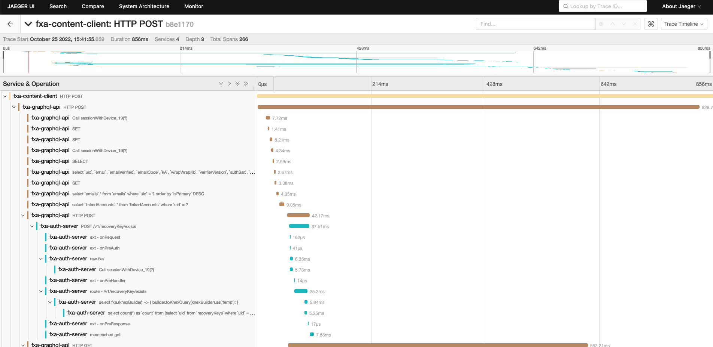
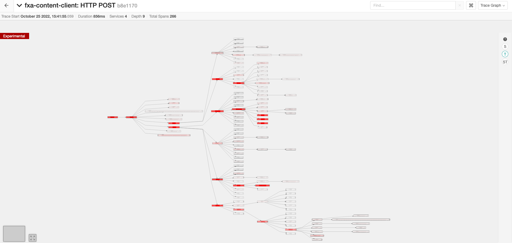

Configuring tracing is much the same as any other service. A configuration file can be found in fxa-shared/tracing/config.ts. From there adjusting defaults can be done via environment variables.

## Configuring Local Development
Setting the following environment variables which can easily be done by adding them to a .env file in FxA root, and then starting FxA by running `dotenv -- yarn start`. 


1. If you don’t already have dotenv installed, [install it](https://www.npmjs.com/package/dotenv-cli). 
1. Next add these settings to a the .env file in fxa root:
   ```bash
        TRACING_SAMPLE_RATE=1
        TRACING_BATCH_PROCESSING=false
        TRACING_OTEL_EXPORTER_ENABLED=true
        TRACING_OTEL_COLLECTOR_ENABLED=true
        TRACING_OTEL_COLLECTOR_JAEGER_ENABLED=true
    ```
1. Now stop the dev stack with `yarn stop`.
1. Now start the dev stack with `dotenv —- yarn start`.
1. Once the dev stack has started. Run `pm2 status`. Both the otel-collector and the Jaeger service should be in an ‘online’ status. 


#### Some sanity checks to ensure that tracing is working
- Jaeger and otel-collector pm2 service will be online
- Applications will log a `trace initialized` message
- Traces will start showing up in [Jaeger UI](http://localhost:16686)
- You should also see logs in the otel collector. They should indicate a connection to jaeger was setup.
- If you start using the application, you should also see requests going to http://localhost:4318/v1/traces coming from the client side.


## Viewing Traces in Jeager

Once you are capturing traces, the next thing to do is explore them. Locally, we use Jaeger, which has a UI component that is fairly intuitive. Here's a quick use case that should get you going. 


1. Follow the configuration steps above. Then go to http://localhost:3030 and go through a sign up flow.

1. Select fxa-content-client from the services drop down. Then click `Find Traces`.


1. Select the trace with the longest elapsed time .This should be a post to graphql.


1. Note that we are seeing traces across multiple services. Fxa-content-client calls graphql which calls auth server and profile server, which also calls auth server.


1. In the upper right switch the view to the ‘trace graph’ view. This will render a graphical view of the calls. Long running spans will be highlighted if you select the (T) option on the left hand toolbar.



1. Finally, in the main toolbar go to ‘System Architecture’. This will give a view of how the various services relate to one another.


