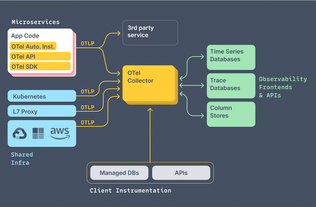
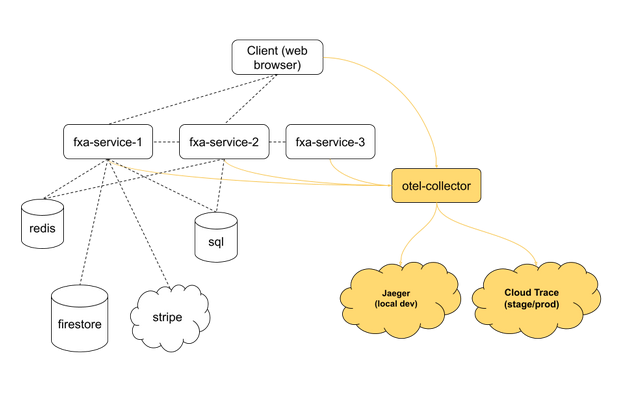

# Distributed Application Tracing

Distributed tracing allows developers to investigate how data flows between various parts of the application. At a high level a trace is just a series of events called spans that represent the timings and state of various operations. When properly implemented, tracing should let a developer visualize the data flowing between services, starting with a request at the client and flowing all the way to the database layer, or third party APIs, and back. Tracing can be useful for finding inefficiencies or errors in code that might otherwise be unrecognized or be difficult to track down.

We utilize [Open Telemetry](https://opentelemetry.io/) to instrument our servers, collect, and export trace data. Open telemetry allows tracing to be fairly agnostic. Rather than implement a specific tracing solution, e.g. sentry tracing, a developer adds open telemetry and then configures it to export to various targets. It’s also good to note that open telemetry supports more than just traces. In theory we could also use it to capture metrics and logs and then export them accordingly. However, at the time of writing this document, open telemetry is only being used for tracing. 

## System Diagrams

Here is a general system diagram taken from open telemetry’s website. As you can see various services, infrastructure, and clients are being instrumented. Spans and traces are being collected and sent to a collector service which then pushes them to a database for later viewing.




And for a more general FxA view on this. Here’s a diagram showing how traces flow from clients and services to the collector, and are then directed to either jaeger for local development or google cloud trace for stage / production.



_Dotted lines represent interservice communication and yellow lines represent exported trace data._

## Terminology of Application Tracing

Once some of the basic terminology for tracing is known it becomes quite approachable. Here’s a quick run down of key terms that are particularly useful for understanding tracing in FxA’s implementation. A full glossary can be found [here](https://opentelemetry.io/docs/concepts/glossary/).


### Tooling

These are the software tools we use to trace. You'll see these get referenced a lot.

**[Open Telemetry](https://opentelemetry.io/)** - SDKs and APIs used to add distributed tracing to our applications. This provides auto instrumentation, and exports traces to various targets.

**[Google Cloud Trace](https://cloud.google.com/trace)** - A cloud native GCP service that allows us to capture and view trace data.

**[Jaeger](https://www.jaegertracing.io/go)** - Similar to google cloud trace, this lets us capture and view traces, but it can be run locally with a stand alone docker container.


### General Concepts

Here's some terms that come up a lot when talking about tracing. They are universal to distributed tracing platforms.

**Span** - A span is just a single operation. In a nutshell it has a start/end time, attributes, some context, parent trace id, and previous span id.

**Trace** - A trace is just a set of spans held in a directed acyclic graph. Traces generally ‘fan out’, beginning with a single request, then showing all the subsequent requests that occur as data flows through the system.


### OpenTelemetry Concepts

Here's some open telemetry terminology. These terms will be found in our source code, so they are worth mentioning.

**Providers** - This ‘provides’ a tracing solution. In our cases it does so for either a nodejs server or a web browser, and it contains the configuration for Samplering, Instrumentation, and Exporting,    


**Samplers** - This makes the decision about whether or not to capture a trace. We generally capture a subset of traces to limit the amount of data collected.


**Instrumentations** - Hooks into existing code, typically popular npm modules, and wraps key calls with spans. This is where the ‘magic’ happens.


**Exporter** - Sends spans to a target collector. In our case, some post processing may occur in the exporter. Our exporters are configured to send spans to google cloud trace, or jaeger for local development.


**Collectors** - Collects and aggregates spans sent from exporters. Collectors then generally store span data in one or more databases. Collectors may also do some post processing of the data and in some cases might make sampling decisions.

**Tracer** - Used to create new spans

**Propagators** - These allow trace context to propagate between services. Essentially it just decorates outbound messages with enough data so that the next service has enough info to keep the trace going. 

**Context** - This is an object that is made available between spans inside a service. It operates in a nested manner. Here’s an [example of context](https://opentelemetry.io/docs/concepts/glossary/).


# Advanced Topics

In all likelihood, viewing traces and setting a few configuration options is all that will ever be needed to work with tracing. However, there are a couple other topics for more advanced usage that are good to cover.

### Custom Instrumentation

Instrumentation is the process of hooking into existing code so traces can be captured. This is mostly automatic. The [@opentelemetry/auto-instrumentations-node library](https://www.npmjs.com/package/@opentelemetry/auto-instrumentations-node) provides ‘auto’ instrumentation which allows us to easily instrument most aspects of node applications. For example, auto instrumentation will capture all outbound HTTP requests, and sql queries.

By default, all instrumentations are enabled. In the future we may want to prefer more targeted instrumentation, as this would result in a smaller number of dependent packages; however, at the time of writing, the ability to easily instrument and gain awareness of all the things that can be traced outweighs the desire to have reduced dependencies.

The instrumentation portion of tracing may seem like a bit of magic at first, however, if you look under the hood at some of the source code you will see the instrumentations are actually pretty straightforward and follow some basic patterns. They use a combination of Asynchooks and good old fashion method hijacking to wrap spans around functions making requests. 

A lot can be learned from looking at existing trace implementations which can be found [here](https://github.com/open-telemetry/opentelemetry-js-contrib/blob/main/plugins). Is there a custom integration that FxA needs?

It's also easy to instrument a single portion of code manually. Perhaps you have a routine that might be time consuming, but you aren't sure exactly how time consuming it is. Wrapping it with a span is pretty easy. Just [aquire the tracer](https://opentelemetry.io/docs/instrumentation/js/instrumentation/#acquiring-a-tracer) and [wrap the routine with a new span](https://opentelemetry.io/docs/instrumentation/js/instrumentation/#create-nested-spans). 

### Filtering PII

It’s important that we filter out any personally identifiable information from the data we capture in our traces. We should follow the same procedures that are followed for Sentry data. Essentially anything that might identify a user needs to be stripped out. A good example of PII is an email address. Essentially if the data contains something that can be used to identify a user uniquely it is likely PII. When in doubt, ask about the data in question.

In open telemetry filtering can happen in two ways. Some instrumentations support filtering data before it is even captured. Unfortunately, this is not uniform between instrumentations. Therefore, we will opt to filter on export. This allows us to [modify the data](https://github.com/mozilla/fxa/blob/6a415eb4c4aac4a5eabf4c79857b7874d09811b1/packages/fxa-shared/tracing/exporters/fxa-otlp.ts#L38) just before it is sent off. We have access to all the spans and their attributes / tags at this point in time. Simply mutating this data should be sufficient for filtering out PII. 

#### Some final guidelines for filtering PII are:
- Be proactive about removing PII from traces. If you see something in a trace that could uniquely identify a user, file a ticket calling it out!
- Ideally we still leave as much of the data intact as possible. For example, if there is a sql query containing an email address, if possible, leave the query intact and only filter out the email. E.g { query: `select * from users where email = [FILTERED]` }  as opposed to { query: `[FILTERED]` }
- Be mindful of performance. If a data field is to be processed, consider truncating it. - If there are an extremely large number of elements to loop through, consider short circuiting and remove elements that can’t be processed. 
- Keep in mind the goal is to provide as much info in the trace as possible while still being pragmatic about removing PII.


### Sending Traces to Google Cloud Trace Locally
In the event that trace export isn’t working properly on stage or production, the need to debug this locally might arise. If so, follow these steps:

1. Install the [gcloud](https://cloud.google.com/sdk/docs/install) cli tool if you don’t already have it.
1. Make sure you’ve authenticated with gcloud locally, in order to export data. Once you have gcloud install, simply login with this command:
`gcloud auth application-default login`
1. Set your .env file up like this:
   ```bash
        TRACING_SAMPLE_RATE=1
        TRACING_BATCH_PROCESSING=false
        TRACING_OTEL_EXPORTER_ENABLED=true
        TRACING_OTEL_COLLECTOR_ENABLED=true
        TRACING_OTEL_COLLECTOR_GCP_ENABLED=true
   ```
1. Stop pm2 `yarn stop`
1. Start up the stack again with the .env file applied, `dotenv —- yarn start`
1. Check the logs for the collector service, you should see mention of google cloud trace being supported, `pm2 log otel-collector`
1. Go to google cloud trace. If there are lots of traces try narrowing them down with the following filter, `FILTER:/http/host:localhost:9000`

