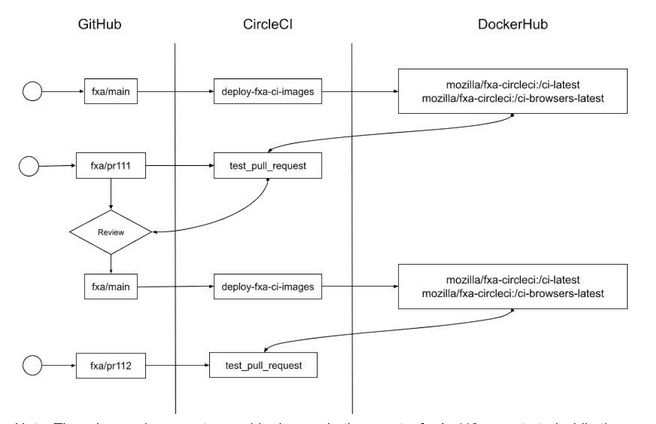
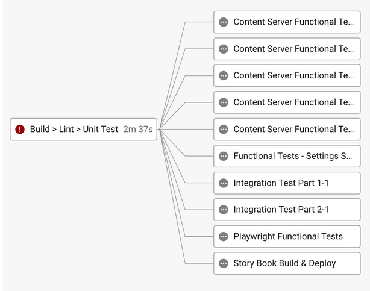
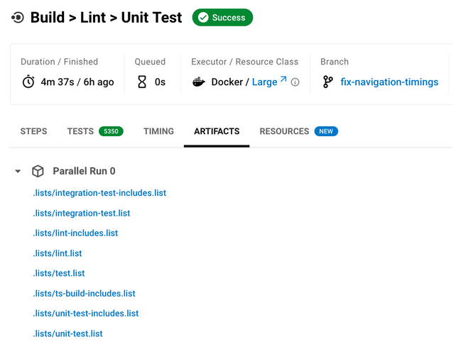
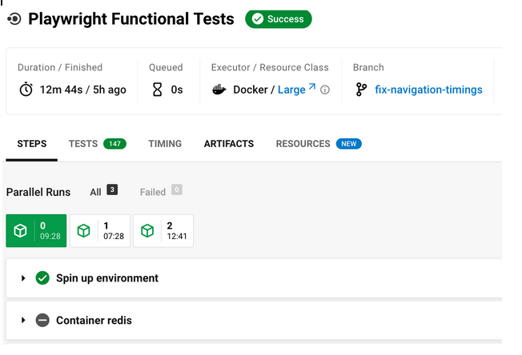
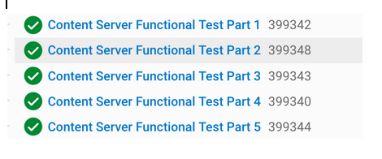

FxA uses a combination of github actions and CircleCI for continuous integration, CircleCI is used for build, test, and deployment. Github actions are used for code quality and security scans that can run independently of CircleCI workflows.

FxA is a monorepo, and there are a couple known challenges associated with running CI in a mono repo context. The challenges are typically:

- Package Management - Mono repos are notorious for ending up with large sets of package dependencies that can take a long time to install in a CI.
- Testing - Since mono repos end up with a large amount of code, it’s more important than ever to have targeted testing. Making a change should result in no more tests run than necessary. 
- Build Times - Since mono repos usually contain multiple workspaces / packages that depend on one another, having a clear dependency tree and only compiling what is necessary is important, and even with the hierarchy, build times can still be significant.

Because each of the above operations becomes potentially more costly in a mono repo, we have constructed the CI with the following design goals in mind:

- Reducing startup cost
- Avoiding redundant, unnecessary operations
- Leveraging Parallel Operations

Each of the following considerations is described in its own section below. Read on to learn more.

## Reducing Startup Cost
In a previous iteration of the CI, a large portion of each CI job was spent creating the initial state required in order to run tests. This included the following steps:

- Starting a docker container (~5s)
- Checking out code (~30s)
- Extracting yarn cache (~45s)
- Installing npm packages (~2:45s)
- Building typescript (~1:15s)
- Installing browsers for functional tests (~1:00) (Only for functional tests suites)

This meant that in order to run a pipeline we were looking at startup costs around 5-6 minutes.  

If we want to think about optimizing pipelines, one of the most effective ways is to parallelize operations. For example, if there was a pipeline with 1000 tests that took 10 minutes to run, splitting these tests into 10 parts and running them concurrently should take 1 minute, a very good reduction of 10x in perceived run time. 

However, if the startup time remained a constant 5 minutes per split part, we would have gone from 10 minutes to 5 minutes and 30s per job or a factor 1.8x, which isn’t nearly as impressive. Essentially this example illustrates the gains we get from parallelization are relative to startup time. The more the startup time is reduced relative to the test run time, the more it makes sense to run tests in parallel. 

In order to combat startup time, we preemptively build custom docker images that are populated with the latest known good state of the fxa-repo and can be used as CI runners for our jobs. Using a custom image essentially offloads the bulk of the work to another process that can be run ahead of time. This works because the vast majority of pull requests are in fact very small departures from the state of the monorepo as a whole. 

It might be a bit hard to visualize just from the pipeline config alone or the description above, so here’s a sequence diagram illustrating the life cycle

:::info
There is an edge case to consider here… In the event a `fxa/pr112` was started while the  `deploy-fxa-ci-image` job was in progress, the `pr112` CI jobs would grab the previously deployed images. Although not ideal, it just means `pr112` will be executed with a slightly outdated image. This could impact the ability to skip the yarn install step, but in all likelihood, it won’t even be noticed.
:::

In a best case scenario, which should also be the most common scenario, we can effectively skip all of the above operations. There are a couple scenarios where some of the steps will still be required:

- The `Build > Lint > Unit Test` job which will require a typescript compilation. The other steps can still essentially be skipped though.
- When the packages have drifted and we detect a change on the lock file. Even with this happens, the yarn install is still considerably faster than because the node_modules is already pre-populated.

So in a nutshell, we took a start up process that would take about 5-6 minutes on each job and traded it for a pre-built docker image that takes about 45s and worst case about 2 minutes to start up. Occasionally we even see cache hits, where the time to pull the custom docker image is essentially 0s, but these aren’t as common as one would hope. Regardless, we still make good improvements by using a docker container instead of building up state from scratch for each job.

## Avoiding Redundant or Unnecessary Operations
FxA relies on several techniques to avoid rendant operations. First of, much of this hinges on the fact we have a pre-populated custom docker image. This alone eliminates a lot of redundancy. Beyond that, however, there are some other things that occurred.

### Preliminary Build & Test Phase
All our pipelines are now guarded by a preliminary job that must pass before moving on to other operations. This job lints code, builds typescript, and executes unit tests. If any of these steps fail, there really isn’t a good reason to proceed. These checks are so basic, that it would surely result in further failures in our more costly integration and functional tests. Essentially, this job guards against running unnecessary tests. 

It is also fairly quick to run, so there isn’t too much of a penalty for introducing it at the start of the pipeline. Here’s a screenshot of of what a failing preliminary build & test job looks like:

As you can see if this job fails, we don’t even bother to run the other tests. Furthermore, the artifacts of the build and post install that occur during this step are cached and restored, so that we don’t have to be concerned about rerunning this tasks in future pipelines. 

## Skipping Tests
We have always done a fairly good job of skipping test suites that aren’t impacted by code change in the PR under test. There is a long standing script that can be found in .circleci/modules-to-tests.js which takes the code changes present in the current PR and determines which workspace packages need to be tested. This code is slightly more sophisticated than yarn workspace foreach –since, so we have continued to use it as the basis for driving which workspace packages to tests.

Essentially this script ensures that we only test code packages that have changed and packages that depend on packages that have changed. The results of this script are stored as ci pipeline artifacts so that it is easy to see which packages will be placed under test. The lists, which are later processed by gnu parallels, are stored in the .lists folder.

## Leveraging Parallel Operations
There are essentially two ways we can run tests in parallel. We can either split tests and fan them out across multiple jobs (instances), or we can use a larger CI runner, and ask it to run the tests in parallel taking advantage of multiple cores. Each approach has some pros and cons, and we use both depending on the scenario.

### Running in Parallel Inside a Single Job
For linting, unit tests, and builds, which are all fairly quick operations, we run the operations in parallel within a single job running on a single CI runner instance. 

We use this approach because these operations only take a couple minutes. As discussed previously, gains from parallelization is directly related to the amount of time it takes to startup a job vs execute the tests. Since we are at about a 1 to 1 ratio for builds and unit tests, we would only see marginal returns by fanning these jobs out.

Note that we ultimately ended up using gnu parallels for running parallel operations instead of yarn workspaces foreach –parallel because of a bug in yarn’s parallel implementation that could result in a false positive in the CI runner. Essentially if a parallel process ran out of memory during a test, yarn would not report it as a test failure.

### Fanning Out Tests Across Many Jobs
For all other tests, we split up tests and then fan them out across multiple runners. Some testing frameworks, like playwright, support test splitting natively. Others, like intern js which is the test platform for content-server, need to have a custom splitting implementation.

Here’s an example of what test splitting and fanning out tests looks like for playwright. Notice how it appears to be a single job, but there are actually multiple runners
Jobs:

An expanded view of the ‘Playwright Functional Tests’ job. Note the 3 boxes indicating the different test runs. The number of parallel runs is controlled with a single CI parameter and can be easily adjusted.

This can be contrasted with the content server, where we hard code 5 distinct jobs run. In order to do this, we rely on script we created that splits up content servers into distinct jobs. It’s not quite as nice as the playwright test splitting, but still quite effective.

Finally, it’s good to know that integration tests are actually a hybrid approach. Here the tests are fanned out across two instances, but each workspace is run in parallel. We ended up doing this because the integration tests are quite a bit longer than unit tests, and also require more memory. After a bunch of trial and error, this hybrid approach seemed to be the most optimal.

## In Summary
These are the approaches we’ve taken to improve CI performance for a mono repo. There’s actually way more nuance that can be read about in this internal [document](https://docs.google.com/document/d/1WM4sLc0qQDzvq_0bX_nfZ1o2BM4M6YzmP33n36NB49Q/edit#heading=h.2jo3ou7ec55z) that is a retrospective on CI performance optimizations and some of the other issues that were encountered along the way. At a higher level this reference probably all that an engineer really needs to know. 

There is still room for more improvement, but for the pass this is where we are at. Ideas for future improvements are:

- Dedicated CI runners could further reduce CI startup time by caching our docker layer images more effectively than circle CI does, this however would involve SRE. 
- Restructuring yarn workspace packages, so that workspaces are broken down into smaller components with clearer dependencies chains. This may result in more skipped tests and faster pipelines. 
- Consolidating dependencies and frameworks to have fewer dependencies and smaller install times. 
- During this work some performance issues were uncovered. Addressing these might help lower resource requirements for tests. 
- Restructuring functional tests, so that they can also be skipped more effectively when not applicable to code changes are at hand.
