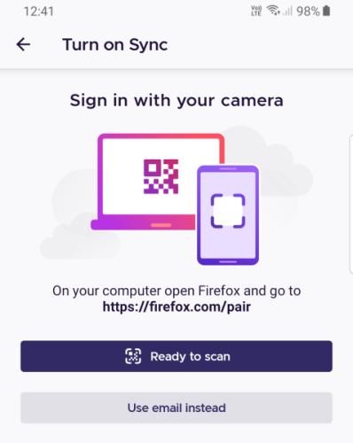

## Overview

A Firefox Account user can connect a new device to their account without entering a password,
by instead "pairing" with an already-connected device in order to obtain account credentials.

Currently, the pairing implementation is limited to a mobile device (Firefox Android and iOS) scanning a QR code displayed on a computer (Firefox Desktop) already connected to a Firefox Account. We hope to expand these capabilities in future.

## User Flow

Let's assume that the user is already signed-in to their Desktop Firefox profile.

On their mobile device, Firefox invites them to navigate to firefox.com/pair on their Desktop browser,
and offers to scan the QR code which will be generated by that device. Like this:

When they visit that URL on their Desktop device, it will confirm their intent to connect
another device, and then generate and display a QR code. Like this:

When the user scans the QR code, each device will show a confirmation screen,
and after user approval the new device will be connected to their account.

A detailed technical user-flow is available [here](https://lucid.app/lucidchart/9a420c19-1e92-42a5-8eae-908a442c1044/edit?page=0).

## Implementation

### High-level description of the flow

1. The two devices exchange a one-time secret key via QR code, and use it to create
   a shared, encrypted and authenticated communication channel over websockets.
    * The [Channel Server](https://github.com/mozilla-services/channelserver) is responsible
      for proxying communication between the two devices.
    * The [Pairing Channel library](https://github.com/mozilla/fxa-pairing-channel) provides the
      crypto necessary to authenticate and encrypt the channel, using TLS1.3 in pre-shared-key mode.
    * The Desktop device is responsible for creating the channel and its corresponding secret key,
      and advertising those details in a QR code.
    * The Mobile device connects to the channel using the details it scans from the QR code.
2. The Mobile device prepares an OAuth request for connecting to FxA, but instead of redirecting
   to a webpage on https://accounts.firefox.com, it sends the OAuth request to the Desktop device
   over the pairing channel.
3. The Desktop device receives the OAuth request, confirms user consent, and uses its existing
   credentials to tell the FxA server to grant a corresponding OAuth authorization code. Instead
   of delivering the code via the usual OAuth HTTP redirect, it sends the code back to the Mobile device over the pairing channel.
4. The Mobile device receives the code and processes it just as it would for an ordinary
   web-based OAuth flow, by talking to the FxA server to exchange the code for some OAuth tokens.

There is some additional message-passing the takes place over the pairing channel in order to
show confirmation screens and help smooth out the experience, but the high-level abstraction
is "do an OAuth flow, but using the pairing channel instead of HTTP redirects".

### Detailed implementation description

The implementation is described [here](https://github.com/mozilla/fxa/blob/main/packages/fxa-content-server/docs/pairing-architecture.md).

Please note that the [FxA Pairing Flow - Application Layer](https://lucid.app/lucidchart/1bc1b604-0047-4542-8827-ed8518b0433e/edit?page=0) Lucidchart diagram should be treated as the __source of truth__
regarding the pairing protocol and kept up-to-date. There is also a rendered png of the diagram available on the [detailed architecture docs](
https://github.com/mozilla/fxa/blob/main/packages/fxa-content-server/docs/pairing-architecture.md#detailed-flow).

### Where does the code live?

- [Channel Server](https://github.com/mozilla-services/channelserver)
- [Pairing Channel](https://github.com/mozilla/fxa-pairing-channel)
- [Desktop client implementation](https://searchfox.org/mozilla-central/rev/23c25cd32a1e87095301273937b4ee162f41e860/services/fxaccounts/FxAccountsPairing.jsm) ([UI](https://searchfox.org/mozilla-central/rev/23c25cd32a1e87095301273937b4ee162f41e860/browser/components/preferences/fxaPairDevice.js))
- [Mobile client implementation](https://github.com/mozilla/application-services/blob/40bef1314d9cf20fdfa8e1c1539a5205c4bdd462/components/fxa-client/src/oauth.rs#L111-L136)
- [Content server implementation](https://github.com/mozilla/fxa/blob/44bbb161d958f084c1bb39902554f69a2333de90/packages/fxa-content-server/app/scripts/models/pairing/supplicant-state-machine.js)

## Security concerns and desired security properties

Described [here](https://github.com/mozilla/fxa/blob/main/packages/fxa-content-server/docs/pairing-architecture.md#intended-security-properties).

## Possible evolutions

- Reverse pairing: allow a computer to connect to an account by scanning a QR code with an already connected mobile Firefox.
- Pairing using a code to type: more accessible, allows device without a back camera to pair (i.e. 2 computers).
